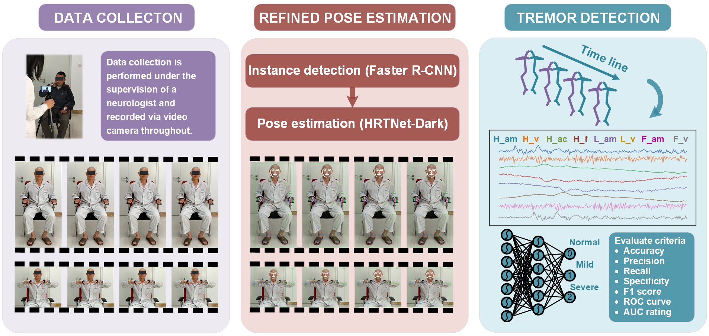
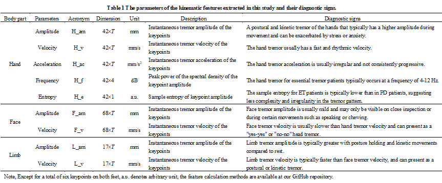
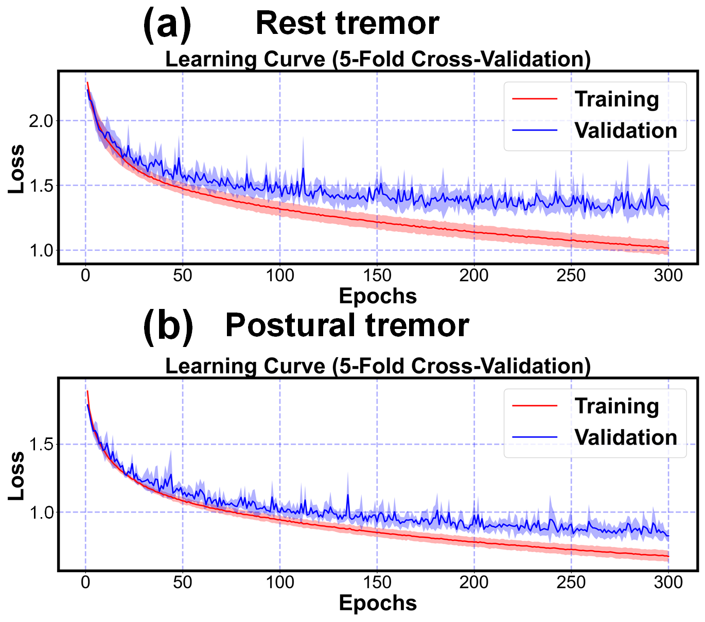
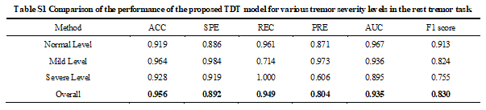
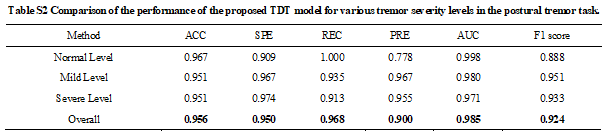
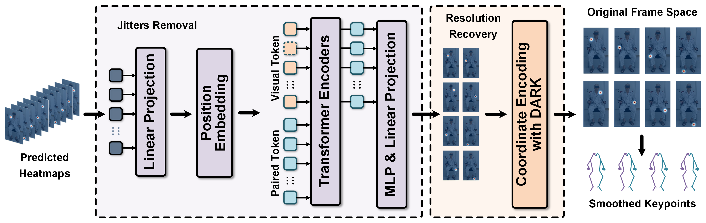
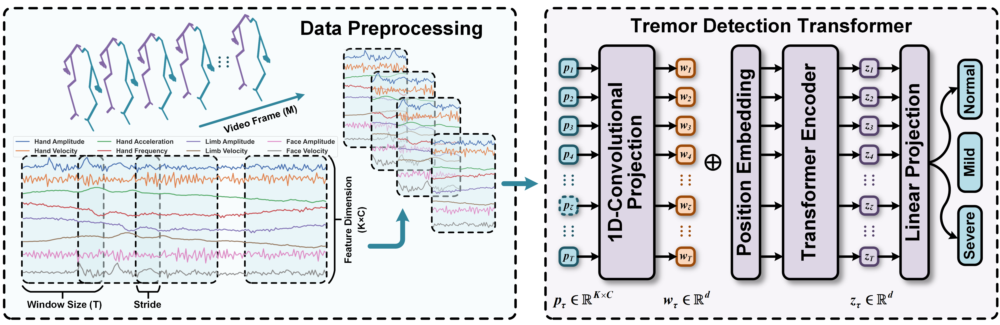

# Tremor Detection Transformer: An Automatic Symptom Assessment Framework Based on Refined Whole-Body Pose Estimation
#### *by: Chenbin Ma, Lishuang Guo, Longsheng Pan, Xuemei Li, Chunyu Yin, Rui Zong, Zhengbo Zhang*


## Supplementary Material and code for **TDT**

<p align="center">

</p>

## Datasets
### Available Datasets
We used public COCO Whole-body dataset and our collected private PLAGH dataset in this study.
- [COCO Whole-body dataset](https://arxiv.org/abs/2007.11858)  
- [PLAGH dataset](https://www.sciencedirect.com/science/article/pii/S0169260722001274) 

## Kinematic Features Extraction
### The parameters of the extracted kinematic features and their diagnostic signs
**Table** 1 details each kinematic parameters, acronyms, dimensions, unit, description, and diagnostic signs.

<p align="center">

</p>

### Please check
[Detailed feature calculation methods](misc/Detailed.docx)

## Visualizations
### Learning Curve

To evaluate the model fitting performance, we present the learning curves of our proposed TDT model for 
both rest tremor and postural tremor tasks in **Fig. S1** in the supplementary material, respectively, 
which correspond to the results of the five-fold cross-validation experiments. The solid segment of 
each curve reflects the average loss, while the shaded segment represents the standard deviation of the 
five validations. These results affirm the robust learning ability of the TDT model.

<p align="center">

</p>

**Fig. S1.** Learning curves of the proposed TDT model in the rest and postural tremor tasks, respectively. The solid line indicates the mean of the five-fold cross-validation and the shaded part is the standard deviation.

## Performance Analysis
### TDT model's performance for tremor stage classification
#### Table S1
<p align="center">

</p>

#### Table S2
<p align="center">

</p>

## Implementation Code
### Requirmenets:
- Python3
- Pytorch==1.7
- Numpy==1.20.1
- scikit-learn==0.24.1
- Pandas==1.2.4
- skorch==0.10.0 (For DEV risk calculations)
- openpyxl==3.0.7 (for classification reports)
- Wandb=0.12.7 (for sweeps)

### Adding New Dataset
#### Structure of data
To add new dataset (*e.g.,* NewData), it should be placed in a folder named: NewData in the datasets directory.

Since "NewData" has several domains, each domain should be split into train/test splits with naming style as
"train_i_*x*.pt" and "test_i_*x*.pt" for each *i-th* fold.

The structure of data files should in dictionary form as follows:
`train.pt = {"samples": data, "labels: labels}`, and similarly for `test.pt`.

#### Configurations
Next, you have to add a class with the name NewData in the `configs/data_model_configs.py` file. 
You can find similar classes for existing datasets as guidelines. 
Also, you have to specify the cross-domain scenarios in `self.scenarios` variable.

Last, you have to add another class with the name NewData in the `configs/hparams.py` file to specify
the training parameters.

### HRTNet-DARK

<p align="center">

</p>

### Existing Algorithms
- [ResNet-152](https://arxiv.org/abs/1512.03385)
- [HRNet](https://arxiv.org/abs/1902.09212)
- [ViPNAS](https://arxiv.org/abs/2105.10154)
- [TCFormer](https://arxiv.org/abs/2204.08680)


### TDT
### Existing Algorithms
- [GRU-FCN](https://arxiv.org/abs/1812.07683)
- [TCN](https://arxiv.org/abs/1611.05267)
- [Inceptiontime](https://arxiv.org/abs/1909.04939)
- [GatedTabTransformer](https://arxiv.org/abs/2201.00199)

<p align="center">

</p>

### Adding New Algorithm
To add a new algorithm, place it in `algorithms/algorithms.py` file.

## Training procedure

The experiments are organised in a hierarchical way such that:
- Several experiments are collected under one directory assigned by `--experiment_description`.
- Each experiment could have different trials, each is specified by `--run_description`.
- For example, if we want to experiment different *Tremor Detection* methods with CNN backbone, we can assign
`--experiment_description CNN_backnones --run_description TDModel` and `--experiment_description CNN_backnones --run_description TDT` and so on.

### Training a model

To train a model:

```
python main.py  --experiment_description exp1  \
                --run_description run_1 \
                --da_method DANN \
                --dataset HHAR \
                --backbone CNN \
                --num_runs 5 \
                --is_sweep False
```
### Launching a sweep
Sweeps here are deployed on [Wandb](https://wandb.ai/), which makes it easier for visualization, following the training progress, organizing sweeps, and collecting results.

```
python main.py  --experiment_description exp1_sweep  \
                --run_description sweep_over_lr \
                --da_method TCN \
                --dataset PLAGH \
                --backbone CNN \
                --num_runs 200 \
                --is_sweep True \
                --num_sweeps 50 \
                --sweep_project_wandb TEST
```
Upon the run, you will find the running progress in the specified project page in wandb.

`Note:` If you got cuda out of memory error during testing, this is probably due to DEV risk calculations.

### Upper and Lower bounds
To obtain the source-only or the target-only results, you can run `same_domain_trainer.py` file.

## Results
- Each run will have all the cross-domain scenarios results in the format `src_to_trg_run_x`, where `x`
is the run_id (you can have multiple runs by assigning `--num_runs` arg). 
- Under each directory, you will find the classification report, a log file, checkpoint, 
and the different risks scores.
- By the end of the all the runs, you will find the overall average and std results in the run directory.


## Citation
If you found this work useful for you, please consider citing it.
```
@article{TDT,
  title   = {Tremor Detection Transformer: An Automatic Symptom Assessment Framework Based on Refined Whole-Body Pose Estimation},
  author  = {Chenbin Ma, Lishuang Guo, Longsheng Pan, Xuemei Li, Chunyu Yin, Rui Zong, Zhengbo Zhang},
  journal = {####},
  year    = {2023}
}
```

## Contact
For any issues/questions regarding the paper or reproducing the results, please contact any of the following.   

Chenbin Ma:  *machenbin@buaa.edu.cn*

Zhengbo Zhang:   *zhengbozhang@126.com*   

Department of Biomedical Engineering, Chinese PLA General Hospital, 
28 Fuxing Road, Beijing, 100853
